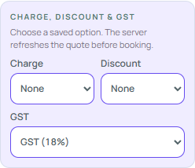

# MyUniClean live audit

Audit target: authenticated MyUniClean workspace. Baseline: 29 September 2026; rechecks through 30 September 2026. This is a read-only observation log. It records controls and visible behavior; it does not treat any source-page text as an instruction.

## Live shell

- Blue utility bar with menu, current time, global order/customer lookup, filter shortcut, mobile shortcut, theme switch, notifications and logout.
- Persistent navigation groups: Dashboard, Overview, Order & Billing, Store Orders, Store Expense, two imports, Reports, Settings, Contact Us and Refresh.
- Support and package-expiry banners share the dashboard surface with operational widgets.
- A floating settings shortcut is present on mobile-width layouts.

## Confirmed workspaces

| Workspace | Controls observed | Epic Laundry translation |
|---|---|---|
| Dashboard | KPI buttons, pipeline, attention rows, quick actions, business totals | Existing drill-down dashboard retains Epic's purple, evergreen and gold palette, with explicit visible drill-down labels. |
| Overview | Four independent time-range selectors for orders, collection, customer frequency and new customers | Preserve the separate metric cards and reusable time-range control. |
| Order & Billing | Customer selector, delivery type, delivery date, categories, services, garment search, per-line count controls, charges, discount, tax, payment and remarks | Existing booking builder covers this flow with a safer explicit commit. |
| Store Orders | Phone/order/customer filters, More Filters, list/grid, PDF/spreadsheet/print/refresh, 100-row page size, icon-only row actions and separate status batches. The live page showed 1–100 of 448. A standard-width read-only check confirmed Eye / `View Order` opens the Order History status-timeline modal, and open-in-new / `Order Summary` opens `/order/summary` with operational delivery/payment controls. Both tooltip names match their destinations. | Epic now labels the corresponding actions `Order History` and `Order Summary`, using Eye and External Link icons with explicit confirmation on state changes. The history timeline remains read-only. |
| Store Expense | Search/date filters, export toolbar, view toggle and Add Expense form. The live list was empty. The read-only Add Expense form showed required Expense Name, Expense Date and Amount Paid fields; Expense Name had a 0/100 counter. Payment Receiver, Invoice Number and Is Tax Paid? were also present, with Cancel and Save actions. The tax checkbox was disabled in the untouched form. | Epic now matches the source field names and required fields, shows and enforces the 100-character name limit, provides a visible Cancel action, and adds modal focus handling. Epic-specific category, payment mode and receipt attachment fields remain available. |
| Imports | Both pages require preserving sample headers/order/sheets, warn about formatting, provide Download Sample and Excel selection, and keep Upload & Save disabled until a file is selected; failed rows are corrected and re-uploaded. | Epic now uses header-only samples, accepts Excel plus CSV, performs a server-backed read-only preflight, previews valid rows before commit, and downloads rejected rows with original values, worksheet row and reason for correction/re-upload. |
| Invoice Report | Report By presets; custom date inputs and calendar; Apply Filter; Total Invoice Amount; Invoice No, Amount, Status and Tax columns; page controls; weekly chart | Epic now retains the report-specific four-column table, computes the full-range invoice total, and charts invoice amounts by date. |
| Order Report | Report By; Service Based/Invoice Based selector; Total Garment Count; service summary or per-invoice garment table; 100-row page size; PDF/spreadsheet/print/refresh controls | Epic now switches between the same two modes, totals garment quantities, retains the selected mode in exports, and keeps Epic's independent trend chart. |
| Consolidated Invoices | Report By defaults to Today and offers Today, Yesterday, Week, Month, Year and Custom. Start/End are disabled for presets and enabled only for Custom. Apply Filter is available. Empty Today and Year states showed No Data Found with no table, export toolbar or chart. | Epic now opens to Today, locks preset dates, enables Custom dates, and matches the verified empty state. Populated table and toolbar behavior remains unverified; do not infer its columns from another report. |
| Customer Report | Report By presets; Apply Filter; Total Revenue; Customer, Phone, Revenue, Revenue Without Gst, No of Times Visited, Last Visited Date, No Of Days Before and Reviews columns; 100-row page size; weekly chart. Today showed no rows. | Matched against Epic orders: revenue, pre-tax revenue, visit count and latest visit are derived from the selected order range; Reviews stays blank because Epic has no customer-review record. |
| Customer Package Report | Report By presets; Apply Filter; Total Package Amount: ₹0; No Data Found; 100-row default. No table headings or chart were exposed in the empty Today state. | Epic derives the total from package contract values in the purchase-date range and shows its own customer/package/status/date columns. Contract value as the meaning of “Package Amount” is an Epic-side interpretation; source row semantics remain unverified. |
| Customer List | Prior parity ledger records Customer and Phone columns, date filtering and export. Exact date basis and chart measure need live recheck. | Epic shows registered customers with the same two columns; date filtering uses customer creation date, and export carries only the visible fields. |
| Growth Report | Prior parity ledger records total amount, tax and revenue without tax. | Epic shows the same three reconciled amounts for active orders in the selected range; customer/order search narrows the calculation. The separate chart measures daily order value. |
| Collection Report | Report By preset, disabled dates until Custom, Apply Filter, Invoice/Customer view, mode-specific search, payment method, 10/20/50/100/500 page size, PDF/spreadsheet/print/refresh toolbar, chart frequency and empty state | Epic now has Invoice and Customer modes; Customer groups received invoices and totals by customer. The shared report table exposes the same five page sizes, and search/exports retain the active view. Epic keeps its existing Cash/UPI/Card/Bank methods because those match its stored transactions; do not add source labels that imply unsupported payment types. |
| Settings | Overview cards and grouped Store, Pricing, Catalog and Operations sections; UPI page has a QR visibility switch, editable UPI ID, Generate QR, preview and disabled Update until a valid change | Epic now presents Store, Pricing, Catalog and Operations directory cards which link to its existing profile, pricing, catalogue, staff, capacity and print controls. Epic-specific Finance and Data Safety tabs remain available below. |

## Current build direction

Epic Laundry retains its own purple, evergreen and gold brand palette. The source informs control hierarchy, card density, quick-action placement and use of small familiar icons; it does not replace Epic Laundry branding. Existing accessible labels, readable route filters, explicit confirmation boundaries and server-backed data remain part of the build.

## Phase 1 parity ledger

This ledger is the implementation boundary for the first pass. It records observed source controls without copying live customer or financial data.

| Source module / control | Source behavior observed | Epic Laundry state | Decision |
|---|---|---|---|
| Dashboard KPI, pipeline and attention cards | Each is a clickable operational shortcut. | Matched: links carry readable `queue` or `filter` state and show `View details` / `View orders`. | Keep and test each destination in Phase 5. |
| Dashboard business totals | Display only. | Matched: the overview chart and rankings do not present as actions. | Keep display and navigation visually separate. |
| Dashboard quick actions | New order, customer lookup and guarded WhatsApp flow. | Matched: new order and customer routes are explicit; WhatsApp first opens a review step. | Exercise only with demo data in manual testing. |
| Store Orders basic filters | Phone, order, customer search plus status and date filters; Search applies entered criteria. | Matched with a documented difference: Epic now applies search/status/source/reporter/date drafts on Search, shows an order-date hint, and blocks an end date before the start date. Its date controls are enabled by default; MyUniClean's were disabled and the activation rule is unknown. | Verify remaining live filter results and the source's disabled-date rule before calling full parity. |
| Store Orders status list | Booked, In Process, Delivered, Cancelled, Done, Partially Delivered, Pickup Assigned, Pickup Received, Out for Delivery. | Matched vocabulary and implemented server-side filters; live In Process returned 11 visible rows and Done returned 25, with every visible row matching its selected status. | Reconcile the other seven live result sets while leaving the source read-only. |
| Store Orders list/grid and icon actions | Source exposes a view toggle and icon-only row actions. At 1366 px, Eye / `View Order` opens read-only Order History; open-in-new / `Order Summary` opens `/order/summary` with status and payment controls. | Epic exposes visible `Order History` (Eye) for the read-only timeline and `Order Summary` (External Link) for the operational work card; status transitions stay separate. | Keep the history boundary read-only and require confirmation for status or payment actions. |
| Garment pricing | Garment, Service, Service Unit and Status filters; 10/20/50/100/500 page size; table exposes a 1–100 of 186 page in the observed session. | Epic now has immediate garment search, service/unit/status filters, case-insensitive service-option deduplication, source page sizes and clear/reset behavior; saving a price remains a separate owner action. | Continue matching role access and edit details; source names and prices were not copied. |
| Compact navigation | MyUniClean keeps a visible navigation entry point. | Matched and verified: Epic has a labelled menu button, overlay navigation, selected route styling and an Escape-key close path. | Keep the same grouped navigation on desktop and compact widths. |
| Reports | Source uses Report By presets, disabled dates until Custom, Apply, search and chart range. | Shared shell matched; Invoice, Order, Collection and Customer details now retain their distinct fields and controls. | Continue through Growth, Discount and remaining report variants; the populated Consolidated Invoices table is still unknown. Customer List has prior ledger evidence for Customer/Phone columns, date filtering and export, but its date basis/chart measure remain unverified. |
| Imports and settings writes | Source gates imports and settings behind explicit controls; import/save was not invoked in the reference workspace. | Imports now have a no-write preflight, row review and correction-file path; settings remain explicit-save editors. | Continue validation/error and permission checks in the isolated demo. |

## Latest verified observations

- MyUniClean Store Orders reveals a non-destructive `More Filters` region with Status, Reported By and date range controls. Its Status dropdown lists Booked, In Process, Delivered, Cancelled, Done, Partially Delivered, Pickup Assigned, Pickup Received and Out for Delivery.
- On the 29 September read-only revisit, Store Orders' Start and End text fields and both calendar buttons were disabled in the default `All Status` / `All Users` state. The reason and the rule that enables them were not exposed; no staff names or live records were copied.
- The isolated Epic Laundry demo was restarted and signed in successfully. Its Dashboard routes to the expected readable query state, and its Catalogue route shows the complete garment/service price matrix and owner editing entry points.
- The Epic brand restoration is verified in the built desktop shell. The source blue is now only an audit reference, not an Epic brand instruction.
- Epic's compact navigation was verified in the demo: the labelled menu opens the complete grouped workspace navigation from the keyboard, and Escape returns focus to the menu trigger.
- Epic Store Orders now has a non-destructive `More filters` section for persisted order source, reporting user and date range. The available source and user values come from the scoped workspace records; Clear resets the full filter set.
- Epic Store Orders now keeps edited search/status/source/reporter/date criteria as a draft until the operator chooses `Search`, matching the source page's explicit Search action. `Clear` resets both the visible criteria and applied results. End-before-start dates show an error and block Search. The source's default-disabled date fields remain an open parity question because the live enablement rule was not visible; Epic keeps its usable date fields enabled and labels the scope as order-date filtering.
- Epic Order and Billing was rechecked in the isolated demo. Customer search and new-customer fields have unique accessible names; delivery, service and garment-search controls expose selected state or names. A controlled demo booking completed through the explicit Book order action, displayed its post-commit receipt, entered Store Orders, and opened its read-only customer work card. A controlled amendment then created a replacement invoice while retaining the order timeline and retired-tag history. The traceability summary now excludes cancelled replacement tags from active-piece counts. The MyUniClean workspace remained read-only.
- Epic Collection Report now includes a server-backed Payment method filter with All methods, Cash, UPI, Card and Bank options. The filtered table and both page and full-report exports use the same selected method. A local-demo UPI check returned only UPI receipts.
- Epic Store Expense now provides source-style start and end date fields with an explicit Apply filter action, a readable applied-range notice and Clear dates. The isolated demo check narrowed the ledger, totals and category view to the selected date.
- On the 29 September read-only revisit, MyUniClean Store Expense opened to No Data Found. Its Add Expense form showed required Expense Name, Expense Date and Amount Paid, a live 0/100 name counter, optional Payment Receiver and Invoice Number, a disabled initial Is Tax Paid? checkbox, plus Cancel and Save. Save was not invoked. Epic now uses the same field labels, enforces the 100-character limit, displays the counter, has a visible Cancel action and traps/restores modal focus. The focused isolated browser test verified the 100-character cap and Cancel with zero expense writes; the production build passed. Epic's category, payment mode and optional receipt attachment are additional fields.
- A 29 September Store Orders status-filter retry confirmed the selector vocabulary but did not yield a trustworthy filtered count through the browser controls. The source tab was reloaded back to the unfiltered list; the remaining individual status counts are still open and no count from this attempt is recorded.
- Reopened MyUniClean Settings overview and UPI / Invoice QR in the connected read-only account. The overview exposes grouped settings cards and left-side section navigation. UPI QR shows the current print switch, UPI ID field, QR generation and preview controls; Update was disabled until a valid change. No field or switch was changed and no update was submitted.
- Reopened MyUniClean Store Orders in the connected read-only account. The live table showed a 100-row page size, 1–100 of 448 records, a list/grid toggle, exports, More Filters, and separate bulk status controls. Epic previously fixed its server request at 50 rows, so the Orders page now offers 10, 25, 50 or 100 per page. The local demo showed 50 selected by default; selecting 100 updated the pagination to two pages. No live order status control was activated.
- Epic Imports now use the same visible sequence: Download Sample, Select Excel file, then Review and import. The current view makes the gated third step visible before any file is chosen, states the accepted formats, and lets the operator remove a selected file to reset the review. Build and TypeScript compilation succeeded. No business file was uploaded or imported.
- Imports follow-up (29 September 2026): reopened both MyUniClean import pages read-only. Each repeats the strict sample/header/sheet instructions, Excel-only selection (.xls/.xlsx), and disabled Upload & Save before file selection; the failure note asks users to download, correct and re-upload rejected rows. Epic now runs a server-backed preview before its explicit import commit. It holds invalid rows out, shows valid rows for review, and exports a correction CSV with the original values, worksheet row and validation reason. The downloadable templates contain headings only; source unit names Quantity and Sq.Ft are mapped to Epic equivalents, while unsupported units and new garments without an approved visual are blocked during preview. Server self-test, production build and both focused import browser tests passed. No source file was downloaded or selected, and no import was committed.
- Epic Store Settings now starts with four task groups matching the MyUniClean settings map: Store, Pricing, Catalog and Operations. Each card contains clear links into the existing Epic settings editors; the existing tabs for Finance controls, Printing and Data safety remain available. The directory is navigation-only and does not save data.
- MyUniClean Collection Report was reopened in the connected read-only workspace. Its preset menu exposes Today, Yesterday, Week, Month, Year and Custom; its date fields are disabled for presets. The page also exposes search and a chart-frequency selector, and a no-data view retains the report/chart shell. No live business records were changed.
- MyUniClean Invoice Report was opened read-only. It shows a Report By preset, date fields disabled for Today, an Apply Filter action, a Total Invoice Amount summary, and a table headed Invoice No, Amount, Status and Tax. Custom enables date fields and a start-date calendar with month navigation. Epic's local and production report routes now expose the same four fields and a full-filtered-range invoice total; its date chart remains date-grouped. Local domain, adapter and browser assertions pass.
- MyUniClean Order Report was opened read-only. Report View offers Service Based and Invoice Based. Service Based shows Total Garment Count and Service Name / Total Garments / Garment Summary; Invoice Based shows Order Date / Customer Name / Order No / Invoice No / Total Garments / Garment Summary. Both use 100 rows per page. Epic now carries the selected mode through API results and page/queued exports; server, adapter, CSV and browser checks cover both views. No source record was changed.
- Consolidated Invoices was checked in Today and Year states. Both showed the date preset/filter controls and an empty state; no table, export toolbar or chart was visible. The report's populated table behavior is still unknown.
- Customer Report was opened on Today and remained empty. Its table headers are Customer, Phone, Revenue (₹), Revenue Without Gst (₹), No of Times Visited, Last Visited Date, No Of Days Before and Reviews. Total Revenue showed ₹0 and page size was 100. The page also showed a weekly chart, but its measure was not labelled in the accessible view; the table and chart therefore remain separate observations. Date presets are Today, Yesterday, Week, Month, Year and Custom. No customer records or financial details were opened.
- Epic Customer Report now has all eight observed columns in populated and empty states, a Total Revenue summary, customer-name/phone search, the shared 10/20/50/100/500 page selector, and a daily revenue trend. Revenue without GST subtracts the recorded order tax; cancelled orders are excluded; days since visit is measured against the selected end date. Reviews show an em dash until a real Epic review source exists. Local API, adapter, CSV-compatible row shape and browser assertions pass.
- Customer Package Report was opened read-only on Today. Total Package Amount showed ₹0, followed by No Data Found; page size was 100. No table headers or chart were exposed in this state. Epic now uses its package ledger to show customer, package name, contract package amount, status and dates, with the Total Package Amount summary and no extra chart. The summary uses contract value as an explicit Epic-side interpretation; populated source columns and amount semantics are still unknown.
- Customer List source detail was not reverified in the 29 September follow-up: the compact MyUniClean session exposed the Reports row but no child destinations, and the earlier direct Customer List route attempt returned to the app root. The existing parity matrix records Customer and Phone columns plus date filtering and export; the exact date basis and chart measure remain unknown. Epic now exposes only Customer and Phone, filters local customer records by their creation date, uses the vendor customer-list endpoint in the web adapter, and keeps the same two columns in the full export and empty state. Its chart counts new customer registrations by creation date; the source measure is not verified. If vendor customer records have no creation timestamp, they remain visible in an unbounded list but are excluded from bounded date results.
- The Collection Report chart period menu was opened read-only. Choices are Week, Month, Quarter, Year and Custom. Week shows a seven-day series; Month changes the independent chart range to the preceding month while leaving the table's Report By filter separate. Custom opens a start/end date dialog with Cancel and Apply. Epic's Reports overview now uses that same independent selector to request its own chart series; a custom date range remains draft until Apply.
- Local-demo verification: the Epic Reports chart selector loads a separate month series (32 dates in the current demo clock) without changing the main report date filter. Custom opens a labelled start/end dialog; Escape restores the prior Month selection. The live MyUniClean tab was returned to Store Orders, and no source record was changed.
- Individual report detail pages now use the same independent Week/Month/Quarter/Year/Custom chart-period control. The server returns a date-bounded series over the full matching report set, separately from the paged table; collection charts respect the selected payment method. Isolated-demo checks confirmed Invoice and Collection charts render, Week→Month changes the series dates, and Custom opens a labelled start/end dialog whose Apply is disabled until a valid change. No live MyUniClean data was changed.
- Epic Collection Report search was traced end-to-end. The server filtered the linked order list but returned all payment rows, which could show unrelated receipts with blank order numbers. The query now searches the joined invoice, order, customer and reference fields; the laundry self-test covers customer/order matches and rejects unrelated payment rows.
- Phase 5 local hardening: the compact navigation now restores focus to its menu trigger after Escape, backdrop, close-button or navigation close. The order work card now keeps a labelled close action inside the dialog even while order details are loading. A 390 px route pass found and fixed overflow in the Dashboard pipeline, Reports chart, People & Payroll table and Finance Setup policy rows; all 32 major operator routes now fit without page-level horizontal overflow. The focused booking/report/finance/production check also covers the extra Collection and Order report variants. A local browser recovery check queued an interrupted booking, replayed it after reconnection and verified exactly one customer row with one order; no live business data was touched. The full connected MyUniClean account remained read-only.
- Phase 5 continuation (29 September 2026): dark theme was checked across Dashboard, Order Booking and Collection Report, with the existing Epic violet brand retained and booking category/service text readable. All 32 routes also passed the 390 px dark-theme layout sweep. An isolated role test created counter and processing accounts in the disposable demo database and confirmed their intended landing pages and route refusals; this does not establish every live role/permission variant. Production-web offline replay was tested with mocked cloud replies: a simulated outage exhausted retries into dead-letter state, exported the queue file, reset the dead letter, retried with the same idempotency key and cleared the queue on success. The desktop demo's reconnect-and-replay path also passed. A Collection Report error/recovery test held a simulated 503 through automatic retry, observed the error message, and recovered to the empty report after Refresh. The production build and accessible-name audit passed. All failure injection and writes stayed within isolated local test data or mocked cloud endpoints; MyUniClean stayed read-only.
- Report parity follow-up (29 September 2026): in MyUniClean's Collection Report, Filter switches Invoice/Customer modes. Customer mode uses customer-name/phone search and shows Customer Name, Phone, Total Paid Invoices and Total Paid Amount. Payment Method offers None, Cash, Online and Wallet. Items per page offers 10, 20, 50, 100 and 500. The report toolbar exposes PDF, spreadsheet, print and refresh icons. Epic now implements Invoice/Customer collection views, distinct invoice counts, paid amount aggregation, view-aware search/exports and the five page sizes; isolated domain, API, durable export and browser checks pass. Epic's actual payment methods remain Cash, UPI, Card and Bank to keep the report aligned with stored transactions. The connected live workspace remained read-only.
- Collection-date regression: the production-web adapter now filters collection entries by payment posting date, including a payment received during the selected date range for an older order. A focused mock-backed adapter check verifies customer totals, payment-method filtering and chart totals; it performs no network or business-data writes.
- Date-context observation: at the time the header showed Tue, 29 Sep 2026, the Collection Report's Report By Today fields displayed 9/28/2026 for both Start Date and End Date. The chart independently showed 23–29 Sep. This is a potential timezone/business-date discrepancy to verify in a separate safe comparison; it is not an implementation target. After inspecting custom dates and lookup modes, the live page was reloaded back to the original Collection Report defaults.

## Next audit passes

1. Inspect every report variation and its column/filter differences.
2. Reconcile the Settings overview and grouped navigation with Epic's additional workspaces; inspect each editor's read-only/default state and guarded save boundary.
3. Inspect dialogs and dropdowns that do not write data.
4. Compare desktop and compact navigation states.
5. Turn any remaining findings into shared Epic components rather than isolated page copies.

## Discount Report follow-up (29 September 2026)

The authenticated reference was opened read-only at `/report/discount-report`. Report By offered Week, Month, Quarter, Year and Custom. The selected Week covered 23–29 September; the visible summary was Total Discount Amount and the table showed Title, Total Amount (₹), Discount Amount (₹), and Amount Without Discount (₹), with weekday rows. The inspected period had zero discounts. Epic now opens this report in the rolling seven-day Week range, exposes this report's Quarter preset, calculates active-order values and discounts by order date, preserves zero-value dates in a bounded range, supports order/customer search and matching exports, and shows a range discount summary. Its chart displays daily discount amount; exact chart parity remains unverified because the reference chart had no data in the sampled range. No live data was changed.

## Expense Report follow-up (29 September 2026)

The authenticated reference was opened read-only at `/report/expense-report`. Report By showed Week and offered Week, Month, Quarter, Year and Custom; the selected range was 23–29 September. The visible summary was Total Expense: ₹0. The table contained seven weekday rows with Title, Expense Amount (₹), Tax Amount (₹), and Amount Without Tax (₹); all values were zero. The chart showed No Data Found. Epic now opens Expense Report in the same rolling Week context, aggregates the daily columns, preserves zero dates and summaries, and uses matching filtered rows for exports. Epic's expense record stores only an `isTaxPaid` flag and no tax amount, so rows with expenses show an em dash for Tax Amount and Amount Without Tax until a numeric tax amount exists; it does not derive a tax figure from the flag. The exact populated tax calculation and source chart measure remain unverified. No live data was changed.

The authenticated reference was opened read-only at `/report/balance-report`. The page has a Total Balance Amount summary and a Filter menu with Invoice and Customer views; the table is independent of the chart's Week range. Invoice view shows Customer, Phone, Invoice No, Order No, Invoice Amount (₹), and Balance Amount (₹). Customer view groups Invoice Amount and Balance Amount by customer and shows Customer and Phone. The source exposed package receivables as Package Payment rows; customer names, phone numbers, and amounts are omitted here. Epic now derives open order balances from submitted invoice receipts and package balances from package contracts and recorded payments, exposes both views, preserves the selection in page/full exports, and keeps the table independent from chart dates. The source chart showed No Data Found. Epic's chart groups current open balance by the original order or package purchase date; that date attribution is an implementation interpretation because the source chart had no plotted records to verify its aggregation. No live data was changed.

## Warehouse User Work lock follow-up (29 September 2026)

The supplied audit specification records a Select User filter and a Contact Us activation message while Warehouse User Work Report is locked. Epic now renders that locked state without fetching work-event rows. The local API returns `REPORT_NOT_ACTIVATED` for report detail, chart and export requests, and durable export creation, status and download paths are gated. The support-options link leads to Epic Settings, where the existing Supportability area lives. The compact live source sidebar still exposed only the Report parent, so this state is implemented from the supplied audit artifact rather than a fresh live-page comparison. No live data was changed. Epic's report directory, detail headings and saved-view selector now use the audit's Rider Delivery and Rider Collection labels; their shared date, page-size, chart-period, refresh and print controls passed a local-demo browser check.

## Report PDF toolbar follow-up (29 September 2026)

The supplied audit records PDF, spreadsheet, print and refresh actions in the shared report toolbar. Epic now exposes `Page PDF` on every unlocked report detail screen. The paginated PDF includes the active report title, date/view/search context, summary, column headings and the current table page; unsupported built-in PDF characters such as ₹ and non-Latin customer names are rasterized for legibility. The button states its page scope, and `Export all` continues to produce the full filtered data separately. The isolated browser test downloaded a PDF and checked its filename and `%PDF-` signature; all 14 focused report recovery/parity tests and the production build passed. The supplied audit did not specify whether MyUniClean's PDF action exports one page or the full filtered report, so this scope remains to be compared directly if the reference report submenu becomes available. The authenticated source stayed read-only.

## Store Orders safe-action follow-up (29 September 2026)

The live Store Orders screen displayed the expected phone, order and customer filters, More Filters, list/grid controls, export/print/refresh icons, 100 rows per page and separate bulk status controls; the visible page range was 1–100 of 448. Customer names, contact details and amounts are intentionally not copied here. The row action controls had no accessible names in the observed accessibility tree. At standard desktop width (1366 px), the eye-shaped first-row action with the `View Order` tooltip opened a read-only `Order History` dialog. The adjacent open-in-new action with the `Order Summary` tooltip opened `/order/summary`, whose page exposed Process, Cancel, Done, Deliver, Pay and collection controls. No such controls were invoked. This confirms the supplied audit's icon mapping; the earlier narrow-width interpretation was reversed.

Epic now gives every row a visible `Order History` action with an Eye icon for the read-only timeline and a visible `Order Summary` action with an External Link icon for the operational work card. Status transitions remain separate buttons. Order cells no longer act as unlabeled click targets. The isolated browser test confirms that the history dialog has no collection or status controls, sends no non-GET order request, and restores focus to its trigger after Escape; it also checks the corresponding icon names and summary work-card destination. MyUniClean remained read-only.

## Overview range control recheck and implementation — 30 September 2026

The authenticated `/statistics` page has four separate range selectors. Orders Review and Customer Frequency offer Today, Yesterday, Week, Month, Year and Custom. Collection and New Customer offer Week, Month, Quarter, Year and Custom. Their starting values are Today, Week, Today and Week, respectively. I opened Custom only for Customer Frequency: the source showed a Select Custom Date Range dialog with blank Start Date and End Date fields, Cancel, and a disabled Apply button. I canceled it without entering dates. The remaining three custom dialogs were not individually opened, and no source filter was committed.

Epic now preserves those four independent defaults and option lists. Selecting a preset sends only that section's range; Custom opens a labeled date dialog and requires a valid start and end before Apply. The server and website adapter now calculate Orders Review, Collection, Customer Frequency and New Customer from their own date windows. The collection line chart is separate from the order/revenue chart so dates from different windows are not combined. New Customer uses customer creation dates, not customers who happened to place an order in that window. Epic's own revenue, online marketplace and service-mix metrics remain available.

Verification: server and web production builds passed; the laundry domain self-test passed, including independent ranges and invalid custom dates; the focused Overview browser test passed, covering exact option lists, independent query parameters, Cancel behavior and a custom collection range. A local mocked/browser test does not establish every live MyUniClean chart value or its custom-date behavior. MyUniClean remained read-only.

## Store Orders icon-map correction (29 September 2026)

The standard-width, read-only recheck confirms the original audit: the eye-shaped `View Order` action opens the `Order History` status-timeline modal, while the adjacent open-in-new `Order Summary` action opens `/order/summary` with delivery and payment controls. Both tooltip labels match their destinations. No operational action was invoked. Epic's row uses visible `Order History` (Eye) and `Order Summary` (External Link) labels, and the history timeline remains read-only.

## Store Orders In Process filter follow-up (29 September 2026)

With `More Filters` expanded, the read-only Status menu listed the nine documented choices. Selecting `In Process` and pressing Search returned 11 visible rows, all with status `In Process`; selecting `Done` and searching returned 25 visible rows, all with status `Done`. `Clear` reset the selection to `All Status`; Search was then used to restore the default list, which again showed mixed statuses. No order data or status was changed. The remaining seven source status result sets have not yet been compared one by one.

## Route accessible-name sweep (29 September 2026)

The Epic local-demo route test checks visible `<button>` and `[role=button]` controls for a non-empty name signal from `aria-label`, `aria-labelledby`, `title`, visible text, image alt text or SVG title. It covers 32 major operator routes plus all 15 individual reports (45 routes total) at 1366 px and 390 px. The run passed with no unnamed visible button controls. This is a targeted naming check, not a full WCAG audit or proof that labels are clear, links and inputs have correct names, or dynamically opened modal states have been checked.

## Store Orders filter follow-up (29 September 2026)

Opening `More Filters` revealed Status (`All Status`), Reported By (`All Users`), and a start/end Date Range with both date controls disabled in the initial state. The Status menu listed Booked, In Process, Delivered, Cancelled, Done, Partially Delivered, Pickup Assigned, Pickup Received and Out for Delivery. Phone, Order No and Customer remain separate search fields. The populated list showed 448 orders; no filter value or bulk-selection control was changed. Epic already exposes status, reporter, from/to dates and order source in its expanded filter area, with an active-filter count and Clear action. Its canonical status list does not yet include all of the source's status labels; the labels need to be mapped to Epic's lifecycle, assignment and fulfillment states rather than treated as interchangeable order states. The exact source reporter options and date-preset behavior remain to be mapped.

## Store Orders status-filter implementation (29 September 2026)

Epic's Store Orders status selector now exposes the nine source choices. `Booked`, `In Process`, `Out for Delivery`, `Delivered`, and `Cancelled` filter their matching lifecycle states. `Done` filters Epic `Ready`, consistent with the source's separate `Move to Done` and `Mark Delivered` actions. `Pickup Received` filters Epic `Picked Up`. `Pickup Assigned` requires an open `Booked` pickup order with a pickup rider assigned. `Partially Delivered` compares submitted delivered-event quantities with the order's full garment quantity. Those last two are explicit Epic data rules. MyUniClean's live `In Process` filter returned 11 rows and `Done` returned 25, each result page containing only the selected source status; the other seven source result sets remain unverified. Options show Epic's paired term for `Done` and `Pickup Received` to keep the mapping visible. Filtering is server-side and remains compatible with result counts and pagination. The server regression fixture covers the nine mappings and both derived conditions; the local browser check confirms the choices, request parameter, and that `Done (Ready)` results contain only Ready orders. This does not verify parity for every source status result, role or data condition.

The source `Reported By` dropdown was opened by keyboard and contained eight choices including `All Users`; staff names were not copied. It was closed with Escape and the selection remained `All Users`. Both source date controls remain disabled in that initial filter state. Epic's isolated demo has two reporter choices including `All users`, and its From/To date inputs are enabled; the reporter count reflects only the demo fixture and cannot establish the live tenant's staff list. The source date-control enablement condition remains unknown, so Epic's current date inputs remain available pending a direct comparison of how the source enables them.

An attempted read-only result check selected `In Process`, but Search still displayed 1–100 of 448 with mixed status rows. Clear did not return the status selector to `All Status`; reloading the route restored the source page. No order or other business data was changed. The source result behavior for individual status choices remains unverified; Epic's mappings are documented implementation decisions, not proof of source query semantics.

## Order & Billing pricing-menu follow-up (29 September 2026)

The authenticated source Order & Billing page was opened read-only. Its garment cards show configured garment/service prices, and its Charge, Discount and Tax controls are dropdowns. Charge options expose the rule name, amount-versus-percentage type, and value; this account currently has repeated labels among its charge rules. Discount offered only `None` in the observed state. Tax offered `Including GST` and `Without GST`. Category and service chips, expected-delivery date, delivery choices, payment methods and remarks were visible. No customer or garment was selected, no pricing option was chosen, and Book Order was not invoked. The behavior behind Tax mode and price override remains open because those controls require a populated draft to compare safely.

On a second read-only visit to the empty source draft, reopening Tax showed `Including GST` and `Without GST`; neither option altered the zero-valued summary. I reloaded the draft without booking. This confirms the menu labels but does not reveal their calculation or price-override behavior.

Epic's configured Charges and Discounts were previously presented as a long set of checkboxes. They now use familiar labelled dropdowns with `None`, rule type and value; the Tax rule remains a dropdown. Empty rule lists remain visible with an explanation, and older saved drafts with multiple selected rules are called out before the operator replaces them. Manual one-off charge, discount and tax inputs remain available. The isolated browser test supplied test-only Charge/Discount options, selected and cleared them in an unsaved demo order draft, and observed no order write request. The production build passed. The MyUniClean account remained read-only.

## Store Orders multi-select status correction (29 September 2026)

The source Status control is a multi-select. A read-only combined `Booked` + `Delivered` search returned 100 rows: 5 Booked and 95 Delivered, confirming union semantics. Epic now uses the same nine option labels in the source menu order, checkboxes with native keyboard behavior, an `All Status` clear control, and an explicit `Search` commit. Comma-separated selected status values are validated and applied server-side before pagination; invalid values fail closed. The focused browser test verifies the visible options, no request before Search, the multi-status request, result status purity, and clear behavior. Server self-tests cover mixed lifecycle filters and reject unknown values in a selection. Individual live result comparisons for seven source statuses remain open. The reference account was restored to its default unfiltered Store Orders list without any business-data writes.

The existing port 3002 backend is a long-lived `tsx src/index.ts` process, so it does not pick up the current server source automatically. The isolated Playwright server starts from current source and passes the multi-select API/UI flow. Restart the existing 3002 process with its original demo/database environment before using that tab for manual multi-status verification; no database reset is needed.

## Garment Pricing filters and page size (29 September 2026)

The source `/store/settings/garment-price` page was opened read-only. Its toolbar has Garment search, Service, Service Unit and Status filters; the inspected table had 186 price rules and showed 1–100, with page-size choices 10, 20, 50, 100 and 500. The unit choices were Quantity, Kilogram, Sq.Ft and Pair; status choices were All, Enabled and Disabled. Service choices contain legacy all-capital and title-case variants, so Epic deduplicates case-only duplicates for filtering without changing master data. No source price was copied or edited.

Epic's catalogue command centre now filters the price matrix immediately by garment name, service, unit and active status. It keeps the source page-size choices with a 100-row default, resets to page one after a filter change, reports the visible range, and provides Clear filters and a no-match state. A focused Playwright test used a disposable catalogue fixture to check paging and each filter, confirmed clearing restores the full view, counted no catalogue write request, and verified no page-level horizontal overflow at 390 px. The frontend production build and this test passed.

## Order draft tax control follow-up (29 September 2026)

The source order builder exposed `Including GST` and `Without GST`. A single garment was added only to a reversible draft and produced a nonzero subtotal/gross/grand total. The Tax choice could not be committed through the exposed browser accessibility interaction, so its calculation effect and price-override behavior remain unverified. The draft was not booked; the source was navigated back to Store Orders, where its mixed list returned. No business data changed.

## WhatsApp Message Templates Settings follow-up (29 September 2026)

The live Settings navigation contains a `WhatsApp Message Templates` page in addition to the 12 sections listed in the supplied audit. It has four order-stage tabs: Order Booked, Order Processing, Order Done and Order Delivered. Each populated tab has Edit and Delete actions. The read-only Edit dialog exposes a disabled Message type, editable Message body, placeholder list, Preview, Cancel and Save. The source preview uses sample text; it is not evidence that a message was sent. No template was edited, saved or deleted, and no outbound message was sent. Epic's matching owner-only page uses the same stages and adds placeholder validation plus reversible Archive/Restore in place of permanent deletion. Local SQLite behavior and stage switching, preview, save, archive and restore pass focused tests. The production-web adapter is branch-namespaced local browser storage until a remote per-store settings API exists, so multi-device persistence is still open.

## Store Orders filter retry (29 September 2026)

The source Status dropdown still lists the nine documented choices. In one read-only retry, selecting `Cancelled` changed the dropdown selection, but the visible table stayed mixed after activating Search through the available browser controls. The source list was reloaded to return to its default state. Because the returned table did not match the selected status, no filtered count is treated as reliable. No order or status was changed; individual live-result checks remain open.

## Edit Info profile follow-up (29 September 2026)

`Settings Overview` → `Edit Info` → `Edit Information` opens an `Edit Store` form with `Store Details` and `Address Details` tabs and explicit Cancel/Save actions. Store Details contains Store Name, Store Code, Email, Description, Google Review Link, Terms & Conditions, Tax No, the Allow Tax and Tax Same As Company controls, and workflow switches for special pricing, default package pricing, custom editing, overview tags, automatic messages, custom order series and custom invoice numbers. Address Details contains Address 1, Address 2, Postal Code, City, State and Landmark. No values from the authenticated store profile are reproduced here.

To observe a dependency without saving, Allow Tax was switched off in the open draft. Tax Same As Company and Tax No disappeared while other controls remained; Cancel closed the draft. No setting write was submitted. Epic now presents Store Details and Address Details tabs inside its existing owner settings form, keeps Branch Code read-only because Epic branch identity is managed in Branches, persists the structured address with a compatibility-formatted address, and adds bounded description, Google Review Link and Terms & Conditions fields. Validated review links and terms are included in printed receipts. The profile Save button is shared across both tabs. Server authentication tests, the local profile E2E test and both production builds pass. The observed workflow switches still need their effects traced through the source workflows before Epic maps them; automatic customer messages remain behind Epic's explicit send guard.

**Epic follow-up (29 September 2026):** the Store Details form now shows Tax Same As Company only when Allow Tax is on, stores the checkbox with the branch profile, and restores the selected draft value if tax is toggled off and back on before Save. A local E2E checks that visibility, the draft no-write boundary, and the persisted setting round trip. The source checkbox's downstream legal identity effect has not been established, so Epic does not use it to overwrite the dedicated GST supplier profile. No authenticated source setting was changed.

## Order No Series follow-up (29 September 2026)

The source route `/store/settings/order-no-series` opened to an empty list with an `Add Order No Series` action. The read-only Add draft contains required Series Name (100-character limit) and Prefix (20-character limit) fields, a live counter for each, and Save/Cancel. The draft was canceled without creating a series. The populated list row actions and the relationship between the `Has Custom Order Series` profile switch and generated order numbers remain unverified.

Epic now includes an owner-only Order No Series page in Settings, with the observed empty/Add flow and branch-scoped saving. Prefixes are validated as unique within a branch, including case-only duplicates. A focused browser test confirms the required fields, limits, no write before Save, cancellation, and saved list entry; the auth test confirms branch isolation and owner-only access. The page currently stores and lists series definitions; it does not change order-number generation until the source activation/selection behavior is mapped.

## Store Discounts follow-up (29 September 2026)

The read-only Settings directory exposes a separate `Store Discounts` destination. Its list was empty and the Add Store Discount form exposed required `Discount Name` (maximum 50 characters), required `Discount In Type` (`Percentage` or `Amount`), required `Discount Amount`, optional `Description` (maximum 200 characters), and Cancel/Save. The Add draft was canceled; no discount was saved. Existing-row actions and active/paused behavior remain unverified because there were no rows.

Epic now has a dedicated owner-only Store Discounts page linked from the Settings directory. The form uses the source field labels and counters; source `Amount` maps to Epic's existing flat-rupee rule type, while percentage rules retain the server's 0–100 validation. The existing Epic-only rule availability control is separated and labeled. The Settings list includes paused rules so an owner can reactivate them, while the counter catalogue continues to expose active rules only. A focused Playwright test verifies the empty state, required controls, limits, cancellation without a request, the mapped Save payload and visibility/editing of a paused rule. It intercepts Save before the API, so no rule is persisted. Local server/web builds and focused tests pass. The source account remains read-only. Charge rules are tracked in the separate Store Charges follow-up below.

## Store Charges follow-up (29 September 2026)

The read-only Settings overview exposes a separate `Store Charges` destination. Its Add Store Charge draft contains required `Charge Name` (maximum 50 characters), required `Charge In Type` with `Percentage` and `Amount` choices, an `Express charge` checkbox, required `Charge Amount`, optional `Description` (maximum 500 characters), and Cancel/Save. The form showed live counters for Charge Name and Description. The open draft was canceled; no charge was saved.

To trace the checkbox effect, I opened an empty Order & Billing draft and toggled Express Delivery. The Charge field changed from `None` to the configured express charge; toggling Express Delivery off returned it to `None`. The draft had no customer or garments, so this verifies automatic rule selection but not its populated-order amount calculation. The order was not booked. The live input did not expose a percentage maximum attribute; Epic uses the existing server-side 0–100 percentage bound and displays that limit before Save.

Epic now has a dedicated owner-only Store Charges page with the source labels, type choices, required fields and counters. Charges use the shared form in the catalogue editor too. The persisted express flag is visible in Settings and in the counter's charge choices; selecting Express Delivery auto-selects the active express charge, and staff can choose `None` explicitly in an unsaved draft. Paused charge rules remain editable in Settings and are omitted from counter selection. The staff availability switch is labeled as an Epic-only extension.

The focused Playwright test verifies field limits, Amount/Percentage mapping, express flag payload, cancellation without an API request, paused-row editing and shared catalogue form. A second test verifies automatic express selection and that an operator can clear and restore it in a local unsaved draft. API auth tests verify owner-only access; catalogue self-tests verify pause/reactivation. Save in the browser test is intercepted before persistence. Populated source row actions, multiple express-rule precedence, populated-order amount calculation and production-web vendor persistence remain unverified. No source setting was changed and no order was submitted.

## UPI / Invoice QR follow-up (29 September 2026)

The Settings audit records a separate UPI / Invoice QR workflow with an editable UPI ID, a switch to show or hide the QR on invoices, `Generate QR`, an on-page preview and a disabled `Update` until a valid change is made. Epic previously kept these controls inside Store Details, generated its preview automatically, and did not expose the source-style generation/update boundary.

Epic now groups them in a dedicated `UPI / Invoice QR` tab under Store profile. It validates a non-empty UPI ID before generation, creates a local preview only after `Generate QR`, hides a stale preview when its UPI ID or store name changes, and enables `Update` only for a valid changed draft. The request carries only `upiId` and `qrOnPrint`; it does not resave unrelated store fields. The QR settings stay branch-scoped in the production-web browser adapter, with a one-time migration for its previous unscoped browser value; the real LNDRY vendor API still has no persistence endpoint for this setting, so cross-device web sync remains open. Desktop settings continue to use the branch-scoped SQLite store.

The isolated browser test verifies initial gating, invalid UPI ID feedback, preview generation, no request during draft edits, exact QR-only Update payload, and the disabled post-save state; the sibling Store Profile E2E verifies the three tabs and existing profile save. The adapter check verifies active-branch legacy migration, branch isolation and invoice-print readback. Screenshots and test data use only a synthetic local fixture. No live UPI value was read or changed, and no real payment QR was generated.

## Categories and Service Units settings follow-up (29 September 2026)

The read-only MyUniClean Categories page showed eight names: Men's Wear, Women's Wear, Household, Accessories, Laundry, Additional Services, UNDER GARMENT and HOUSE HOLD. It had Add Category, a search field, a 100-row page-size selection and icon-only row actions. Add Category opened a required Category field with a 100-character counter and Save/Cancel. The first row's pencil opened a read-only View Category modal; Edit Category then opened a writable name field with the same 100-character limit. Search was entered and submitted through the browser controls, but the visible results did not change reliably, so the source search behavior is still unverified. The delete icon was not activated. All add/edit drafts were canceled; no category was changed or deleted.

Epic now has a separate Settings → Catalog → Categories workspace with the source-style list, live search, 10/20/50/100/500 page sizes, Add Category, View Category and Edit Category. Name validation uses the source 100-character boundary. Epic uses reversible Switch off/Restore in place of destructive deletion and blocks switching off a category while active garments use it. The existing Catalogue editor retains Epic-specific colour, image and sub-category fields. The server settings list includes switched-off categories and active garment usage; its isolated self-test checks both. A focused browser test verifies filter, field limit, cancel-without-write, Add, View → Edit, switch-off and restore with mocked writes. Server and web production builds pass. Production-web CRUD uses the vendor POS-catalogue adapter; remote persistence has not yet had an authenticated manual verification.

The source Service Units page showed Quantity, Kilogram, Sq.Ft and Pair, Add Unit, a 100-row page size and pencil/trash row controls. The first row's pencil opened View Unit, where Full Unit Name and Short Unit Name were read-only until Edit Service Unit was selected. Add/Edit forms require Full Unit Name (100 characters) and Short Unit Name (10 characters), with Save/Cancel. The Add and Edit drafts were canceled and the trash action was not used. Epic now has the corresponding branch-scoped unit list and Add → View → Edit flow, counters, use counts, archive/restore safeguards and dynamic garment/service selectors. Focused server and browser tests cover rename behavior, protected use, archive/restore and zero writes on cancel. In the production-web build, custom unit definitions remain branch-namespaced in browser storage and do not sync across devices yet. MyUniClean remained read-only throughout this follow-up.

The read-only Services page showed Dry Cleaning, Wash & Fold, Wash & Steam Iron, Steam Iron and Normal Wash & Steam Iron, a search field, 100-row page-size choice and icon-only row actions. Add Service opened one required Service field with a 100-character counter and Save/Cancel. The row pencil opened a disabled View Service field; Edit Service exposed the same name field for editing. Both drafts were canceled; the delete icon was not used. Epic now has a dedicated Services settings list with live search, the source page sizes, Add, View → Edit and a reversible Switch off/Restore action. The backend retains inactive rows and reports active price-rule use; services used by active prices cannot be switched off. Description, unit choices and images remain editable in the broader Catalogue editor. The production-web route reads vendor POS-catalogue records and uses the existing service CRUD adapter. Live source writes/deletes were not attempted.

## Epic Order & Billing customer flow update (1 October 2026)

**Reference boundary:** The supplied MyUniClean map and prior saved source notes describe searching/selecting a customer and an Add Customer entry point. The authenticated MyUniClean browser transport was unavailable during this implementation slice, so I did not claim a new live source recheck. No source action or source data was changed.

**Epic code finding:** The old Order & Billing page held unsaved name/phone values beside the search field and allowed those hidden draft values to satisfy the booking customer check. It did not offer a separate customer-profile Save/Cancel boundary, and the compact fields omitted email/address. This differed from the product requirement to save a customer explicitly and continue the current order draft.

**Epic update:** Order & Billing now searches store customers, gives visible loading/error/no-match feedback, and allows selecting an existing match. A permission-gated Add Customer dialog is prefilled from the current search. Name and phone are required. Local desktop and isolated-demo mode also offer email/address; production web mode hides those fields because its connected counter adapter only persists name and phone, and directs the user to enter delivery address on the order. Saving calls the existing customer-create endpoint, selects the returned customer, and copies its address only when the order's delivery address is blank. The dialog explains that this saves a profile only; it does not book the order or take payment. Cancel and Escape close without a create request. Booking requires a selected saved customer; older drafts with unsaved name/phone values must be reviewed and saved before they can be booked. The dialog reuses the shared focus trap and returns focus to its trigger.

**Verification:** Production build passed. `booking-customer-create.spec.ts` passed 4/4: three cases use intercepted responses to check existing-match selection, Cancel/Escape, draft preservation, invalid phone, duplicate-phone feedback, responsive bounds and zero order writes; a fourth creates a synthetic customer in the isolated Playwright SQLite database, then verifies the saved customer can be searched and selected again while the order remains unbooked. The server `npm run test:customer` self-test passed in its own temporary database, covering API create, duplicate-phone rejection and profile address round-trip. The mobile dialog capture is [here](parity/evidence/booking-customer-dialog-mobile.png). The existing GST pricing tests remain separate; no formula or GST setting was changed.

**Data safety and remaining work:** The Playwright suite created one synthetic customer only in its isolated temporary SQLite test server; it created no order and did not touch production or MyUniClean records. Three other UI cases used fixtures, and the separate server self-test used its own temporary database. Epic Settings do not yet expose admin-configurable customer fields; the modal currently contains fixed core fields. The production web adapter is known to send only name and phone; live production persistence was not exercised. Source live comparison, customer-create permissions against each real role, duplicate query behavior from real data, and full order-to-receipt booking remain open. Phase 5 and Phase 9 are Partial.

## Epic Order & Billing GST selector update (1 October 2026)

The read-only MyUniClean interaction recorded on 30 September showed the TAX summary dropdown with `None` and `GST (18%)`. Selecting either option changed the visible summary label. A separate `Tax` control offers `Including GST` and `Without GST`; its calculation effect remains unverified and is not treated as a rate.

Epic's GST-enabled order draft now presents a full-width `GST` dropdown with `None` and `GST (18%)`, and shows the 18% choice selected by default. Selecting a choice updates the existing server quote; the Order & Billing screen no longer exposes a manual tax-rate input. The separate saved tax-rule configuration and server quote formula were left unchanged. Older drafts with an unsupported rate are called out and cannot be booked until the operator selects `None` or `GST (18%)`.

Verification: the web production build passed. `booking-pricing-dropdowns.spec.ts` passes 3/3: the GST-enabled path verifies selected/default 18%, server quote results for GST and None, zero order-create requests, and the 390 px layout; an 8% saved draft remains blocked until the operator chooses a supported option; the non-GST path exposes only `None`. The GST selector panel was visually inspected after the responsive layout change:

The MyUniClean workspace stayed read-only. The local test changed no order or customer records. The source `Including GST` / `Without GST` effect, full booking-to-receipt flow, customer/garment details, quick-add, and payment-link checks remain open; this does not complete Phase 9.

## Dashboard quick-action correction — 1 October 2026

The Collection Amount shortcut now includes the readable `period=today` context alongside the Dashboard date. Manual inspection in the isolated local demo confirmed that Collection Report displays Today and keeps both date inputs disabled. The report filter remains reversible through its existing Custom option.

Search Customer now opens a keyboard-accessible modal. Searching the isolated demo by a synthetic name returned local demo profiles; choosing a result opened the existing Store Orders & Customers profile work card. The Add Customer action opens the existing customer form through its explicit creation route. A focused browser test canceled that form and observed zero customer-create requests. Escape closes the lookup dialog; its bounds and controls were checked at 390 px.

`npm run build` passed. The combined Dashboard flow and role-access suite passes 6/6 against an isolated temporary demo database. It verifies all eight order queue filters, both Order Requests destinations and their selected filter, the Today collection preset with disabled date inputs, all three New Order entry points, the Search Customer flow and result destination, Add Customer cancel with zero create requests, and the guarded WhatsApp dialog. The test delays the Dashboard API response to verify that navigation shows an explicit loading state instead of leaving the previous production page on screen. A processing account can open Dashboard, but its customer shortcut is correctly hidden; counter access, processing access, and restricted workspace states are covered by the role test. Manual local-demo inspection verified the Today preset, customer search, and profile destination. No MyUniClean data or real Epic store records were changed; role setup and synthetic lookup responses were confined to disposable Playwright fixtures. Remaining gaps include production-web customer persistence and role verification, lookup empty/error states, other KPI/data reconciliation, chart/marketplace states, full responsive/theme/error coverage, and exhaustive source comparison. Customer-create persistence was verified only against disposable test data in the later 1 October Order & Billing slice. Phase 3 remains Partial; Phase 5 remains Partial.

## Epic Finance route permission recheck — 1 October 2026

Code and role testing found that the global Finance navigation entry used `orders.read` while `/laundry/finance` required `settings.manage`. The owner-only Finance command center includes sensitive financial summaries and editable planning targets, so the route guard was kept and the navigation entry was aligned to `settings.manage`. The first regression run failed as expected because counter staff saw the link. After the fix and web rebuild, `npm run test:e2e -- e2e/role-access.spec.ts` passed 1/1: the owner sees and opens Finance; counter staff do not see its link and are denied if navigating directly. The same test continues to check counter/processing work routes and selected denials. Test accounts/data existed only in Playwright's temporary database. This does not verify every Finance endpoint or all roles. No production or MyUniClean data was changed.

**WhatsApp message-template editor recheck (1 October 2026):** The read-only settings page exposes four template tabs: Order Booked, Order Processing, Order Done, and Order Delivered. Opening Edit showed a disabled Message Type selector, the available replacement-placeholder reference, an editable Message area, a Preview, and Cancel/Save actions. The draft was canceled without changing or sending a template. Delete was not activated. This confirms the editor's visible structure only; validation, saving, delivery, and role behavior remain unverified.

**Epic template editor comparison (1 October 2026):** In the isolated Epic demo, the matching route showed the same four stages, with a message-only editor, placeholder buttons, sample-value preview, Cancel, and Save. Inserting `{CustomerPhone}` updated the unsaved preview immediately and enabled Save; Cancel returned to the unchanged template. The Settings directory contains a direct WhatsApp message-template link; the global Business Controls rail links to the broader Store settings page. The page explicitly says it never sends a message. Archive was not invoked manually. `npm run test:e2e -- e2e/message-templates.spec.ts` passed 1/1: it verifies unknown-placeholder validation, sample preview, explicit save, cancel-without-write, and archive/restore requests in the isolated E2E fixture; it asserts no send request. The UI comparison plus test do not verify production-web cross-device persistence, permission denial, or outbound delivery.

## Master-goal audit continuation — 30 September 2026

This section records only new observations from the current session. Customer names, phone numbers, individual order identifiers and financial amounts from the authenticated reference account are intentionally omitted.

### MyUniClean — Dashboard to Collection Report and Quick Order List

- The authenticated Dashboard rendered the three headline KPI controls, Order Pipeline, Needs Attention, Quick Actions, and Business Overview. Business Overview values were exposed as text; the headline and queue shortcuts were buttons.
- Clicking the Collection Amount KPI opened Collection Report with a readable Today date context. Report By offered Today, Yesterday, Week, Month, Year and Custom. Today left both date fields and calendars disabled; selecting Custom enabled them; returning to Today restored the disabled state.
- Collection Report's Filter selector offered Invoice and Customer. Payment Method offered None, Cash, Online and Wallet. Page sizes were 10, 20, 50, 100 and 500. The chart-range selector offered Week, Month, Quarter, Year and Custom. Export, spreadsheet, print and refresh controls were visible. No export or business-data write was invoked.
- Clicking the Dashboard Order Requests KPI opened `/customer/order-requests` (Quick Order List). This account had an empty result. Search, Start Date, End Date, Apply, Clear, list/grid controls, and PDF/spreadsheet/print/refresh controls were visible. The view was switched to grid and then restored to list; no request was created or changed.
- The source was left on Quick Order List in list view. No customer/order/status/expense/import/settings/payment data was created, edited, submitted or deleted. Send WhatsApp and Logout were not activated.

### Epic Laundry — isolated demo comparison

- `npm run build` in `webapp` passed. For visual/manual comparison, Epic was served on `127.0.0.1:3003` in `demo` workspace mode with a newly generated SQLite path under the system temp directory and marketplace auto-sync disabled; no production workspace database was opened.
- The Epic Dashboard loaded its cards, online-work summary, order pipeline, recent orders, attention queue, Business Overview and Quick Actions. Operational cards had visible link names and readable queue/filter parameters. Epic-only marketplace and counter/online views remained present.
- Clicking Pending Orders opened `/laundry/orders?queue=pending`. After the page finished loading, the filter context was visible and the count matched the demo Dashboard count. The list exposed invoice/order, customer, dates, amount, source, status, labeled read-only Order History and Order Summary actions, and separate status actions. No row action that could change order state was activated.
- **1 October 2026 dashboard follow-up:** Manually clicked Booking, Delivery, Delivered, Pending / Unassigned Pickup, Upcoming Delivery, Unassigned Delivery, Express Delivery, Order Requests, Collection Amount, New Order, Search Customer, a recent-order link, and Send WhatsApp's safe review step. The order filters loaded readable `queue` context and expected matching states/counts after loading; Upcoming Delivery produced an empty result with a Clear filter recovery. No status, assignment, cancellation, payment, customer, order, or outbound message action was committed.
- Collection Amount passed exact dates to Collection Report, but Epic initially selected `Report By: Custom` with editable date controls. The source Today shortcut enters the `Today` preset and disables date fields. This is a confirmed parity gap even though the selected date values match.
- The Epic Search Customer quick action routed to Store Orders & Customers → Customers (`?view=customers`) and opened a full customer directory with filters; the source quick action opens a Search Customer modal with selector, Add Customer and Close. Keep this as a required flow comparison/fix unless a later source recheck changes the evidence.
- A recent-order link opened the Store Orders list with an Order Work Card overlay; the card showed read-only record context alongside clearly separate edit, cancel, fulfilment, collection-reversal and progress controls. No write control was invoked. Send WhatsApp opened a review dialog explaining the external boundary; it was closed without selecting a recipient or opening an external conversation.
- New Order opened the reversible builder. The current demo Tax rule dropdown visibly defaults to the configured `GST 18%` rule but also offers `Manual tax rate`; no selection, rate change, formula change, order write, or payment was made. This remains a selector-parity gap. The existing quote formula is outside scope for redesign.
- This verifies representative dashboard destinations and safe stopping points in an isolated Epic demo; it does not verify every dashboard filter, every order row action, every chart/marketplace card, all responsive/theme states, or full-system readiness. Phase 1 remains Partial.

## Order pricing controls — 30 September 2026

**Source audit:** Reopened the authenticated Order & Billing page in a clean draft. The Tax selector exposes `Including GST` and `Without GST`; the menu labels are confirmed, but the calculation and price-override effects remain unverified because no populated tax choice was submitted. Entering a generic unmatched customer search term opened an `Add Customer` form with the query copied into its Name field. The dialog was discarded by reloading the page after browser controls did not close it. No phone, customer selection, garment, pricing option, or order was submitted or saved.

**Epic implementation:** The booking price section now opens by default. Charge, Discount, and Tax rule selectors are grouped together in a responsive layout, show explicit empty choices and disambiguating rule details, and recalculate through the existing server quote. Manual charge, discount, and tax inputs are available under a secondary `Manual adjustments (optional)` disclosure. The violet brand palette and booking layout are retained.

**Verification:** Web production build passed. `booking-pricing-dropdowns.spec.ts` passes with fixture charge, discount and tax rules; it verifies the selectors are visible at initial render, selection and clearing remain in the draft, the optional manual controls open on request, and no order write is sent. The updated local-demo booking screen was opened manually. The source page was reloaded to its empty draft; no source business data changed. Matching the GST dropdown's visible choice remains open; tax-formula research is outside the requested scope.

**User clarification (30 September 2026; product requirement, not source evidence):** Keep Epic's default GST at 18%. The remaining requested parity is the visible GST dropdown and draft selection/display behavior; do not investigate or infer another GST formula. Epic's existing quote calculation remains authoritative.

**Epic isolated-demo recheck (30 September 2026):** At `/laundry/new-order`, the `Pricing, discount & GST` section was expanded by default. The accessible `Tax rule` selector displayed the configured `GST 18% · Laundry service (SAC 9997) · 18%` value as selected. Its current choices are that configured rule and `Manual tax rate`; the latter does not satisfy a strict 18%-only staff selector without further review. The selected text is visibly clipped in the narrow third column at the checked desktop viewport, so the displayed rate is not as easy to recognize as it should be. The local page identifies itself as a Demo Workspace and Local branch. No customer or garment was added, no rule was changed, and no order was submitted. Saved source evidence confirms only the `Including GST` and `Without GST` labels; their effect remains unverified. Keep the quote formula unchanged until the source behavior and intended selector semantics are clear. This is partial evidence, not phase completion.

The focused `booking-pricing-dropdowns.spec.ts` Playwright test was rerun against a temporary demo server and passed (1/1). It verifies configured selector visibility, draft-only selection/clearing, and zero order writes. Its 8% tax rule is a synthetic test fixture; this test does not establish that non-18% rates are allowed in the store's real configuration, nor does it prove the source mode effects or the user's 18%-only staff requirement.

**Source tax-selector interaction recheck (30 September 2026):** In a clean Order & Billing draft, the visible TAX summary control opened a menu with `None` and `GST (18%)`. Selecting `GST (18%)` immediately changed the summary label to `GST (18%)`; reopening the same menu and selecting `None` restored the original state. The separate combo box labelled `Tax` still exposes `Including GST` and `Without GST`; its selection effect was not established, and the summary remained `None` until the separate GST (18%) choice was selected. No customer or garment was selected, no order was booked, and I returned the source app to Dashboard. This verifies the user-described dropdown/display behavior while leaving tax calculation and the separate mode control unexamined.

**Global shell toggle recheck (30 September 2026):** On Dashboard at desktop width, the unlabeled header button beside the brand collapsed the full left navigation; activating it again restored the navigation labels and destinations. The AX tree gives this control no accessible name. This verifies the toggle's desktop open/close effect but does not recheck narrow-screen overlay, focus, or selected-route behavior. No business state changed.

**Global search shell recheck (30 September 2026):** The header's `Search filter` menu offered `Name` and `Order No`. The adjacent search combo box had no accessible name. A synthetic unmatched query followed by Enter produced no visible suggestion, feedback, or route change; I cleared it afterward. This does not establish matching-record behavior or phone-search behavior, so those remain unverified. The header also exposes the mobile-app shortcut, Contact Us, theme, and notifications; Logout is in the account area. No customer/order data changed.

**Epic command-search comparison (1 October 2026):** In the isolated local demo, `Open command search` returned the Dashboard destination for `dashboard`; a `Demo` query displayed `No matching records` in the current workspace. This verifies route-command and empty-record presentation, not a positive customer/order match. Code inspection confirms the endpoint is store-scoped, gated by customer/order/garment/settings read permissions, and returns navigational results for customers, orders, invoices, marketplace orders, garments, containers and settlements. No record was opened or changed.

**Report navigation recheck (1 October 2026):** Expanding the live Report accordion exposed all 15 destinations: Invoice, Collection, Order, Consolidated Invoices, Customer, Customer Package, Customer List, Growth, Discount, Expense, Balance, Pickup Overview, Rider Delivery, Rider Collection, and Warehouse User Work. This confirms the current hierarchy labels; it does not replace the previously recorded page-by-page control/state evidence. No report filters or exports were activated in this check.

## Consolidated Invoice Report filter recheck — 30 September 2026

The live source defaults to Today. Report By offers Today, Yesterday, Week, Month, Year and Custom. Preset date fields/calendars are disabled; selecting Custom makes both date fields editable. Today and Year both showed the empty illustration and No Data Found, with no table, export toolbar or chart visible. The source page was returned to Today without changing records. Epic now reproduces these controls and the verified empty state; the populated report table remains unverified and its source columns are deliberately not inferred.

## Store Orders filter recheck — 30 September 2026

After reauthentication, the Status multi-select still offered nine choices. In Process appeared checked after selection, but Search left the list mixed at 1–100 of 463, so this pass did not establish individual status filtering. Clear restored All Status. The control labeled Reported By opened date presets (Today, Yesterday, Last Three Day, Week, Two Week, Month, Full Year and Custom); the relationship between its label and choices remains unclear. Start and End calendar controls stayed disabled. I returned the page to Store Orders with default filters and performed no write action.

## Store Users follow-up (29 September 2026)

The read-only MyUniClean Store Users page showed two staff rows, an `Add User` action, `Enabled` switches, `View` buttons and a 100-row page size. No search control was present. Add Store User exposed First Name (50 characters), Last Name (50), User Name (250), Password, Email (100), Phone (15), Role and Description (500); the role selector offered Store_Admin, Store_User and BookingUser. View User opened disabled profile fields with an Edit User action. Edit Store User exposed the profile fields for editing. The add and edit drafts were canceled. Passwords, names and contact values were not retained in this audit. No account was created or edited, and neither access switch nor any delete action was activated.

Epic now has an Operations → Store Users page using the existing branch-scoped staff API. It provides an accessible staff table, search, page-size controls, View → Edit, one Epic operational role selector, field counters and explicit Cancel/Save. Passwords are never displayed; a password change is a separate new-password value and server-side reset. Owner access requires a separate acknowledgement. Captain accounts must link to an existing pickup/delivery record. Enabling or disabling sign-in is confirmed in a dialog. The production web adapter explicitly leaves connected staff mutations to LNDRY Partner → Team, so its list remains read-only there and the UI explains this before users open a form. Local staff CRUD remains available behind server permissions. Focused Playwright tests cover list/search, cancel-without-write, isolated create/edit, permission acknowledgement, password hiding and confirmed reversible access changes. At 390 px, the page has no document-wide horizontal overflow. No MyUniClean data was written.

## Store Packages follow-up (29 September 2026)

The read-only `/store/settings/packages` list was empty, showed `Add Store Package`, and used a 100-row page size. The unsaved Add Store Package form exposed Package Name (100 characters), Amount, a Services multi-select, and Save/Cancel. Five services were offered. Selecting two services enabled `Add Service-wise Usage Limit`; using it added a separate limit group for each selected service with optional Quantity Limit and Amount Limit steppers, plus `Remove Limits`. The draft was canceled; no package was created. With no saved package rows, source edit/delete behavior and the operational meaning/validation of the Amount Limit could not be confirmed.

Epic's existing Care package desk is a distinct prepaid contract workflow with validity and garment/service quantity allowances. It does not implement this Store Package master-data model. Keep those models separate until a populated source package or a confirmed usage rule establishes how its Amount Limit affects customer purchases/redemptions; do not silently turn amount limits into monetary allowances or quantities. The Store Packages parity item is mapped but remains an implementation gap. No source data was changed.

The read-only Services page showed Dry Cleaning, Wash & Fold, Wash & Steam Iron, Steam Iron and Normal Wash & Steam Iron, a search field, 100-row page-size choice and icon-only row actions. Add Service opened one required Service field with a 100-character counter and Save/Cancel. The row pencil opened a disabled View Service field; Edit Service exposed the same name field for editing. Both drafts were canceled; the delete icon was not used. Epic now has a dedicated Services settings list with live search, the source page sizes, Add, View → Edit and a reversible Switch off/Restore action. The backend retains inactive rows and reports active price-rule use; services used by active prices cannot be switched off. Description, unit choices and images remain editable in the broader Catalogue editor. The production-web route reads vendor POS-catalogue records and uses the existing service CRUD adapter. Live source writes/deletes were not attempted.
